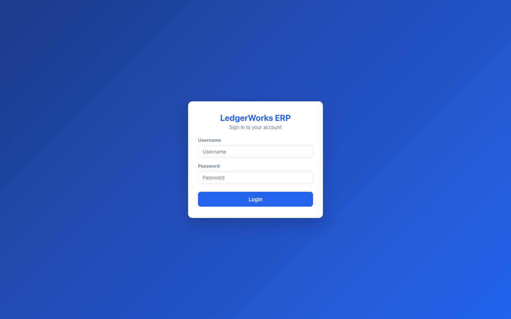
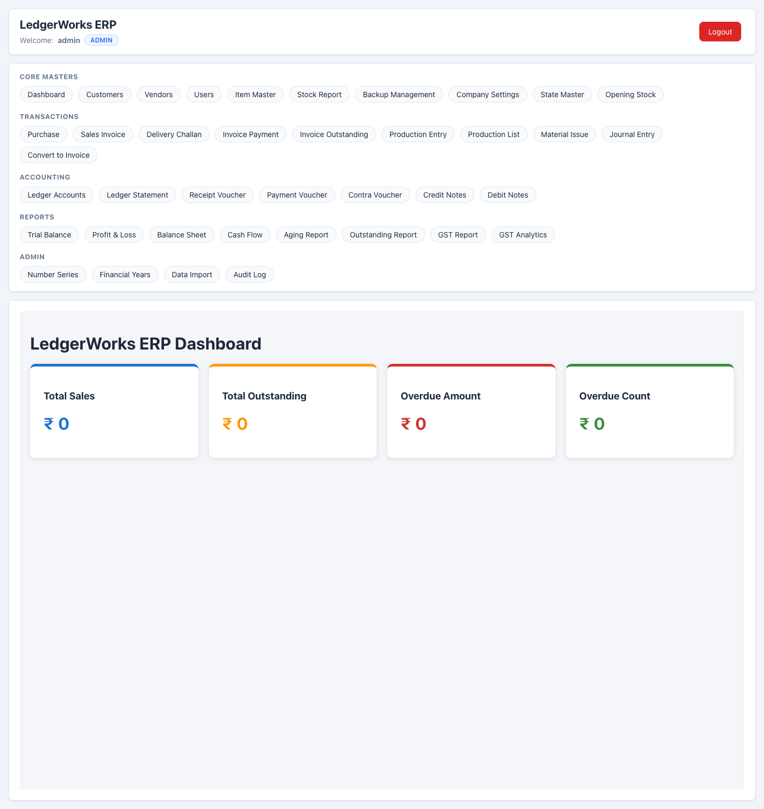
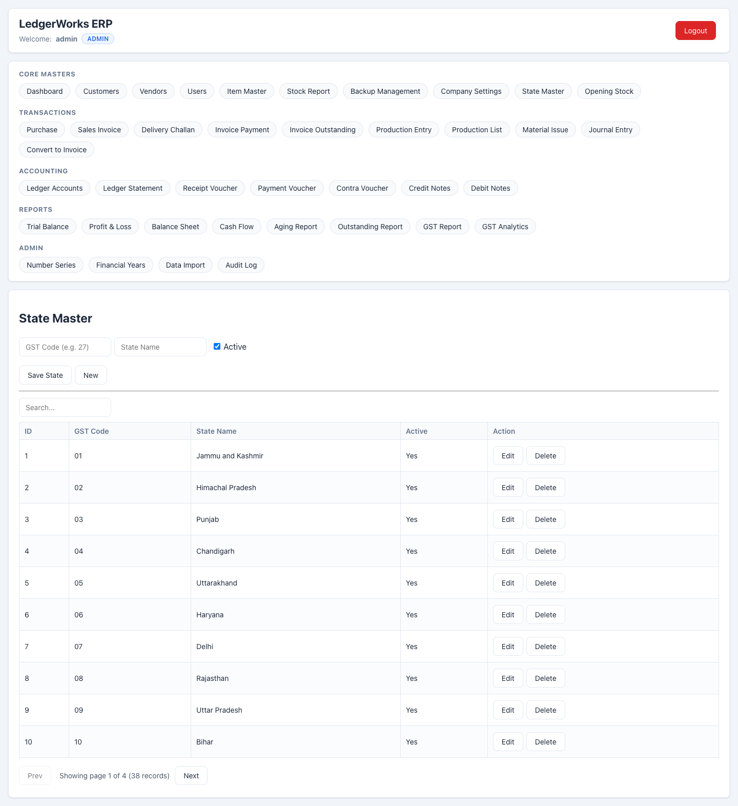
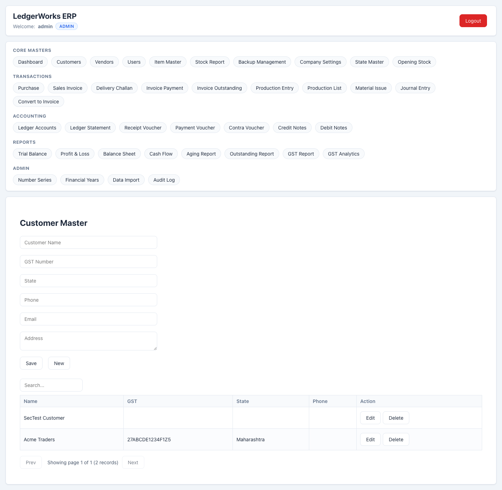

# LedgerWorks ERP

LedgerWorks ERP is a full-stack enterprise resource planning application built with a
**React** front end ([`ledgerworks-ui`](ledgerworks-ui)), a **Spring Boot** back end
([`ledgerworks-backEnd`](ledgerworks-backEnd)), and a **MySQL** database.

## Overview

The system covers the core operational and financial flows of a manufacturing/trading
business through the following modules: **Masters** (customers, vendors, item masters,
ledger accounts), **Inventory** (stock levels and stock ledger), **Purchase** (vendor
purchases), **Sales** (invoices and invoice payments), **Production** (bills of materials,
production runs, material issues and production costing), **Delivery Challan**,
**Accounting** (journal entries, ledger transactions, trial balance, balance sheet,
profit & loss, cash flow), **GST** (GST reports and exports), **Reports** (aging,
outstanding, ledger statements, dashboards), and **Backup** (data backup, download and
restore).

It also includes **configuration & migration** modules — **Company Settings**, **State
Master** (with GST state-code auto-detection), **Number Series**, **Financial Year**,
**Data Import** (Excel/CSV) and **Opening Stock** — plus additional **accounting
documents**: **Receipt / Payment / Contra vouchers**, **Credit / Debit notes**,
**Invoice-from-Delivery-Challan**, and an **Audit Log**. Authentication is JWT-based with
role-based authorization.

## Screenshots

Captured from a real Chrome session (Playwright) driving the running app — login through
every feature. The full sequence (40 images) is in [`docs/screenshots/`](docs/screenshots).

| Login | Dashboard |
| --- | --- |
|  |  |

| State Master (search + pagination) | Customers |
| --- | --- |
|  |  |

> Regenerate anytime with `bash e2e/run-e2e.sh` (boots the backend on MySQL, serves the
> production build, and walks Chrome through all routes).

## Prerequisites

- **Java 17** (JDK)
- **Maven 3.9+**
- **Node.js 18+** and **npm**
- **MySQL 8 or 9** running locally

## Running the Backend

The backend is a Spring Boot 3.2.5 / Java 17 Maven project.

```bash
cd ledgerworks-backEnd
mvn spring-boot:run
```

- The database is **auto-created** on first run (the JDBC URL uses
  `createDatabaseIfNotExist=true` and Hibernate `ddl-auto=update`).
- The default datasource connects as user **`root`** with an **empty password**.
- Override the defaults via environment variables:

  | Variable        | Default                                                                 |
  | --------------- | ----------------------------------------------------------------------- |
  | `DB_URL`        | `jdbc:mysql://localhost:3306/ledgerworks?createDatabaseIfNotExist=true&useSSL=false&allowPublicKeyRetrieval=true&serverTimezone=UTC` |
  | `DB_USERNAME`   | `root`                                                                   |
  | `DB_PASSWORD`   | *(empty)*                                                                |
  | `JWT_SECRET`    | built-in development secret                                              |
  | `SERVER_PORT`   | `8080`                                                                   |

- Backend runs at **http://localhost:8080**
- Swagger UI: **http://localhost:8080/swagger-ui/index.html**

Example with overrides:

```bash
DB_USERNAME=root DB_PASSWORD=secret JWT_SECRET=change-me SERVER_PORT=8080 mvn spring-boot:run
```

## Running the Frontend

The frontend is a Create React App project (React 19, react-router-dom 7).

```bash
cd ledgerworks-ui
npm install
npm start
```

- App runs at **http://localhost:3000**
- By default the UI talks to the backend at `http://localhost:8080`. Override the API base
  URL with the `REACT_APP_API_URL` environment variable:

  ```bash
  REACT_APP_API_URL=http://localhost:8080 npm start
  ```

## Default Login & Roles

A default administrator account is seeded automatically on startup:

- **Username:** `admin`
- **Password:** `admin123`
- **Role:** `ADMIN`

There are four roles:

| Role         | Description                                                          |
| ------------ | ------------------------------------------------------------------- |
| `ADMIN`      | Full access, including user management and backup restore/delete.    |
| `ACCOUNTANT` | Accounting and financial operations.                                |
| `USER`       | Standard operational access.                                        |
| `VIEWER`     | Read-only access.                                                   |

The **Users** management page and the **backup restore/delete** operations are
**ADMIN-only**.

## Configuring GST

GST is configurable in several places:

- **Per-item GST %** and **HSN** on the **Item Master** — invoices and purchases compute
  tax from each item's rate.
- **Company GST number** in **Company Settings**.
- **GST state codes** in the **State Master**; the state for a GST number is auto-detected
  via `GET /api/gst-utility/state?gst=<gstin>` (e.g. `27…` → *Maharashtra*).
- GST reporting and exports under `/api/gst/**`.

## Key API endpoints (Branch-Develop modules)

| Module | Base endpoint | Access |
| --- | --- | --- |
| Company Settings | `/api/company-settings` | read: authenticated · write: `ADMIN` |
| State Master | `/api/states` | authenticated |
| GST state lookup | `/api/gst-utility/state` | authenticated |
| Number Series | `/api/number-series` | `ADMIN` |
| Financial Year | `/api/financial-years` | `ADMIN` |
| Receipt / Payment / Contra vouchers | `/api/receipt-vouchers`, `/api/payment-vouchers`, `/api/contra-vouchers` | authenticated |
| Credit / Debit notes | `/api/credit-notes`, `/api/debit-notes` | authenticated |
| Data Import (Excel/CSV) | `/api/import/{customers,vendors,items}` | `ADMIN` |
| Opening Stock | `/api/opening-stock` | authenticated |
| Invoice from Delivery Challan | `POST /api/invoices/convert/{id}` | authenticated |
| Audit Log | `/api/audit-logs` | `ADMIN` |

## Running Tests

**Backend** (uses an in-memory H2 database — no MySQL required):

```bash
cd ledgerworks-backEnd
mvn test
```

**Frontend:**

```bash
cd ledgerworks-ui
npm test
```

## Security

The backend is stateless-JWT with role-based access control. Hardening applied on `develop`:

- **AuthN/AuthZ**: every `/api/**` route requires a valid JWT (except login, Swagger, CORS preflight).
  Method security is enabled (`@EnableMethodSecurity`) so `@PreAuthorize` rules are enforced.
  **VIEWER is read-only** (write methods denied). **ADMIN-only**: user management, all backup
  operations, company-settings writes, number series, financial years, audit logs, data import;
  **GST exports** require ADMIN/ACCOUNTANT. Backup/GST downloads are authenticated (no longer public).
- **Brute-force**: 5 failed logins per username → 15-minute lockout (HTTP 429).
- **Secrets**: no JWT secret is committed — set `JWT_SECRET` in production (otherwise an ephemeral
  random key is generated per boot and a warning is logged). The seeded admin password is overridable
  via `ADMIN_PASSWORD` (dev default `admin123`) and is never logged — **change it for production**.
- **Headers**: CSP, X-Frame-Options, X-Content-Type-Options, Referrer-Policy are set; SQL logging off.
- **Input**: bean validation on payment input; Excel/CSV import enforces type/row/size caps and
  formula-injection neutralization; backup filenames are validated against path traversal.
- **Frontend**: the JWT is attached only to same-origin/API requests.

### Recommended security follow-ups (not yet applied)
- Move the JWT to an httpOnly, Secure cookie + refresh tokens + server-side revocation (currently localStorage).
- Upgrade Spring Boot 3.2.5 → 3.3.x/3.4.x and bump jjwt/POI/openpdf for transitive CVE fixes.
- Consolidate CORS to one source + externalize the allowed origin; add a password-complexity policy; disable Swagger in production.

## What changed on the `develop` branch

- Restored the real Spring Boot backend (the `main` branch shipped an empty skeleton)
  from an archived zip.
- Replaced the hardcoded `admin`/`admin123` dummy login with real **JWT authentication**
  and **role-based authorization**.
- Added **global JWT attachment** so the token is automatically sent on all axios and
  fetch requests.
- Introduced a **cross-platform, config-driven `BackupService`**.
- Added **SLF4J logging** across the backend.
- Added UI **toast notifications** and a **responsive layout**.
- Added **JUnit tests (H2)** for the backend and **frontend tests**.
- Made the **Delivery-Challan PDF** a dispatch copy (Sr/Item/HSN/Qty only — no rates/tax).
- Implemented the **Branch-Develop missing-features** modules (full-stack, each with
  routes, role-gated navigation, JUnit/frontend tests, and verification on real MySQL):
  Company Settings, State Master + GST auto-detection, Number Series, Financial Year,
  Receipt/Payment/Contra vouchers, Credit/Debit notes, Data Import (Excel/CSV via Apache
  POI), Opening Stock, Invoice-from-Delivery-Challan, and an AOP-based Audit Log.
